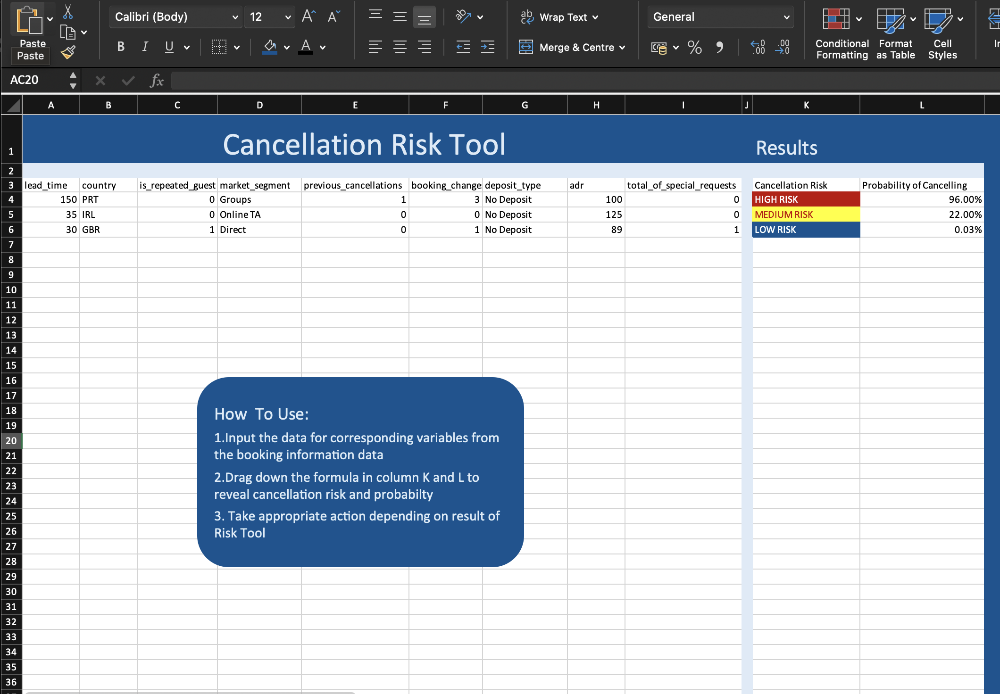
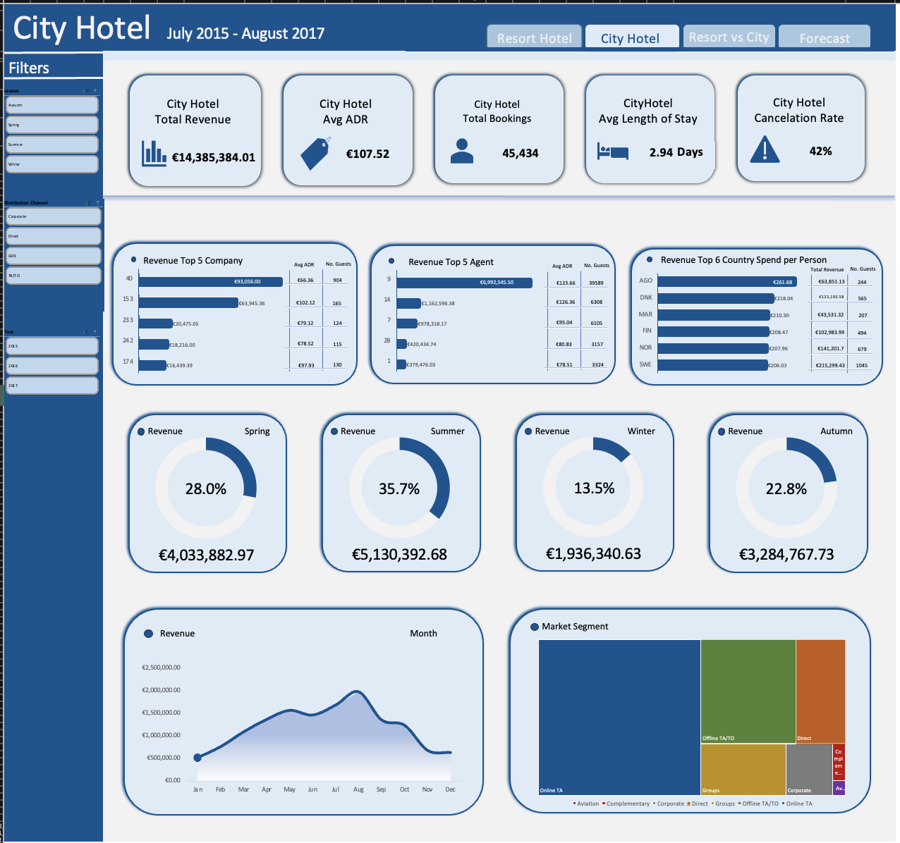
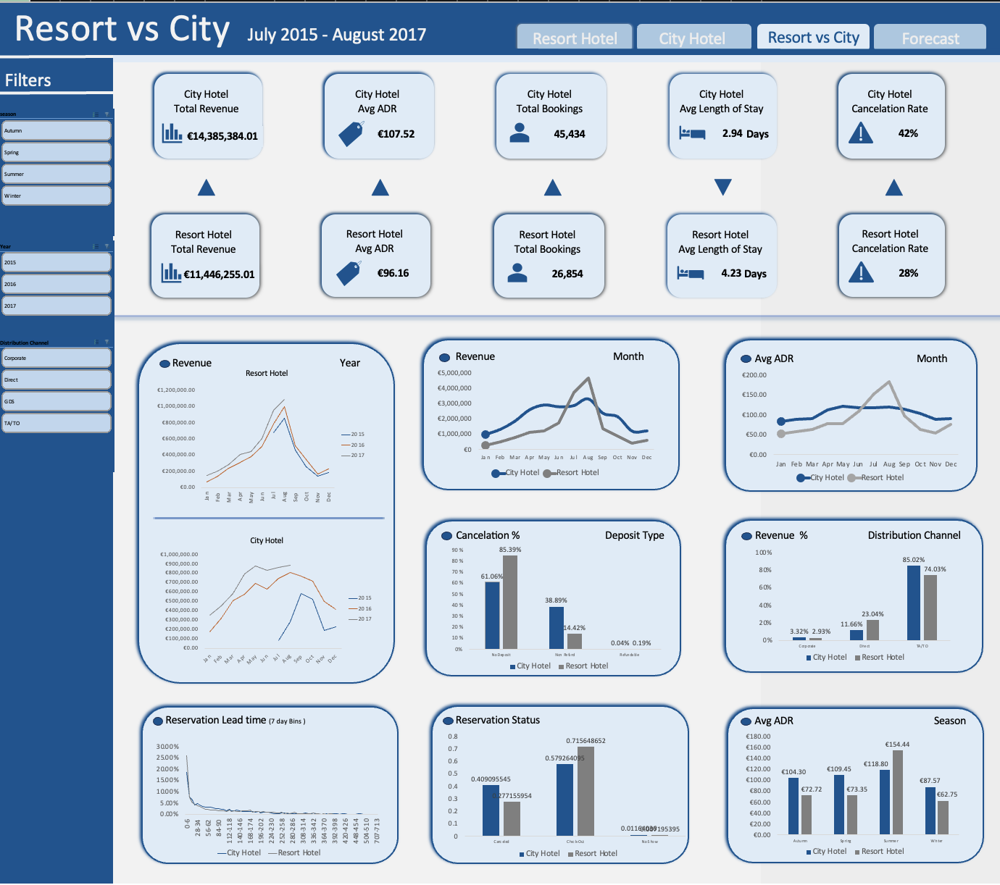
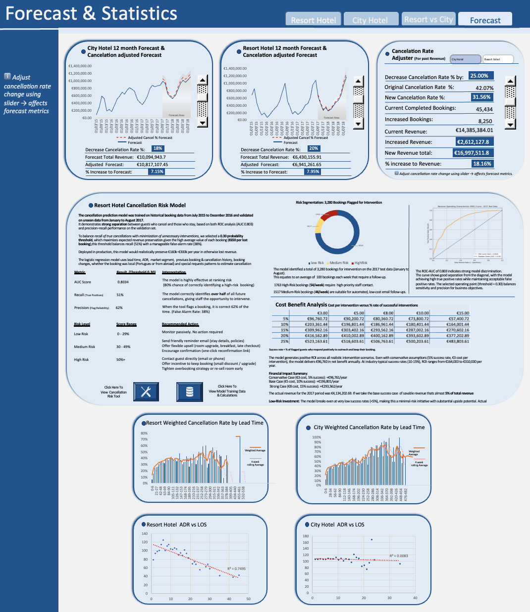
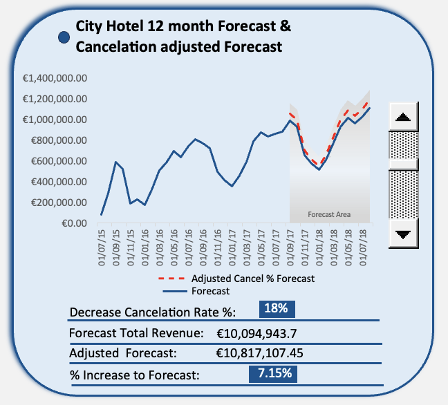
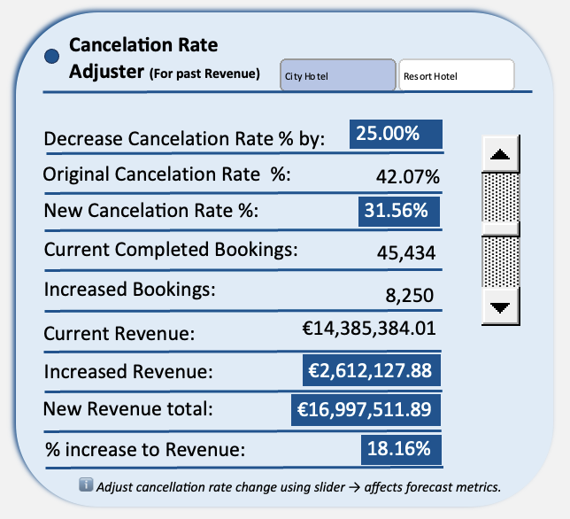

# Hotel Booking Analytics with ML-Powered Cancellation Risk Tool  


**End-to-end analytics project (Excel + Python)** —  that predicts booking cancellations, operationalises a staff-facing risk tool, and quantifies revenue impact using real booking data from two Portuguese hotels (July 2015 – Aug 2017).

## Project Evolution ##

This project began with the goal of keeping everything inside Excel. I built four full dashboards, a heuristic scorecard model, manually calculated confusion matrices, and ROC curves entirely in Excel. As I pushed for better prediction accuracy, I introduced supervised machine learning through logistic regression — but Excel couldn't reliably compute the coefficients.

**Solution:** I trained the model in Python, then deployed the resulting coefficients back into Excel for operational use. This hybrid approach maintains Excel's accessibility for hotel staff while leveraging Python's computational power for model training.

## What's Included

The project demonstrates the complete analytics lifecycle: exploratory analysis, dashboard design, feature engineering, predictive modelling, model validation, and the creation of operational business tools with quantified ROI.

**Core Components:**

- Four interactive Excel dashboards analyzing €25.8M in combined hotel revenue, booking patterns, seasonal trends, and market segments
- Production-ready cancellation risk tool powered by logistic regression (AUC 0.803) that classifies bookings into High/Medium/Low risk categories with recommended interventions
- 12-month revenue forecasting tool with adjustable cancellation-rate parameters to simulate policy impacts
- Historical "what-if" revenue analyzer quantifying past revenue loss from cancellations
- Cost-benefit simulator estimating €57k–€523k in potential annual revenue recovery across realistic intervention scenarios

The system provides weekly intervention workloads (100 bookings/week flagged) and clear, actionable frameworks for staff to reduce cancellations and preserve revenue.


**Note:** This README provides a high-level overview of the project. For detailed dashboard insights, modelling notes, recommended business actions and additional analysis, see insights_actions_notes.md.


## Business Problem
Hotels face significant revenue loss from booking cancellations. The Resort Hotel experienced a 28% cancellation rate while the City Hotel faced 42% cancellations during the analysis period. Without a systematic approach to identify high-risk bookings, hotels must choose between:

- Accepting revenue loss from cancellations
- Implementing blanket policies that may frustrate low-risk guests
- Manually reviewing all bookings (time-intensive and inconsistent)

**Solution:** A machine learning-powered risk assessment tool that identifies high-risk bookings for targeted intervention, with demonstrated potential to recover €164k–€310k annually at realistic 10-15% intervention success rates.


---


## Project summary (what I built)
1. **Cancellation Risk Tool (Excel)**  
   - Logistic regression scoring implemented in Excel using coefficients exported from Python.  
   - Live input form: staff enter booking variables → sheet calculates logit → probability → Low/Medium/High risk with conditional formatting.  
   - Heuristic scorecard (manual, point-based); my initial model to calculate the cancellation risk; ROC & confusion matrix were produced manually in Excel.
   - **Cancellation Risk Tool**  
  

2. **Four interactive Excel dashboards**  
   - **City Hotel**: KPIs, revenue timeline, seasonal revenue, top seling agents
   - **Resort Hotel**: KPIs, revenue timeline, seasonal revenue, top seling agents 
   - **Resort vs City**: comparative analytics.  
   - **Forecast & Statistics**: 12-month forecasts, cancellation-adjusted projections, adjustable cancellation-rate slider, and cost-benefit analysis.  
   - Dashboards use slicers, sliders, hyperlinks and polished visuals built entirely in Excel to mimic BI tooling.
   - **Resort Hotel Dashboard**  
     
     **City Hotel Dashboard**  
      
    **Resort v City  Dashboard**  
       
     **Forecast Dashboard**  
       
     **1 Year Forecast Tool**  
  
    **What If Cancellation Tool**  
     


     

3. **Modeling & Validation**  
   - **Heuristic scorecard**: manually engineered, useful for interpretability but underperformed on ROC.  
   - **Logistic regression (final)**: trained on **July 2015 – Dec 2016**, validated on **Jan – Aug 2017**. Python used for coefficient estimation (Excel numerical limits). Coefficients applied back into Excel for deployment.

---
## Cancellation Risk Model Key metrics (AUC: 0.8034, Threshold = 0.30)


- **AUC:** 0.8034 (strong discrimination)  
- **Recall (True Positives):** 51% — Model successfully catches just over half of actual cancellations.
- **Precision (Flag reliability):** 62% — 62% of flagged bookings are correctly identified as actual cancellations 
- **Predicted positives (flagged bookings on 2017 test):** **3,280**  
  - High Risk: 1,763 (≈54/week)  
  - Medium Risk: 1,517 (≈46/week)  
  - Low Risk: remainder  
- **Average booking value used in ROI:** ≈ **€650**  
- **Selected operating threshold:** 0.30, chosen via cost–benefit reasoning to maximise expected revenue preservation.

**Cost–Benefit / ROI (sensitivity)**

Net benefit calculated as:
Net Benefit = (Flagged × Effectiveness × AvgBookingValue) − (Flagged × OutreachCost)


Representative outcomes (Net Benefit per year from 3,280 flagged bookings):

| Effectiveness | €3.00 | €5.00 | €8.00 | €10.00 | €15.00 |
|---:|---:|---:|---:|---:|---:|
| 5%  | €96,761  | €90,201  | €80,361  | €73,801 | €57,401 |
| 10% | €203,361 | €196,801 | €186,961 | €180,401 | €164,001 |
| 15% | €309,962 | €303,402 | €293,562 | €287,002 | €270,602 |
| 20% | €416,563 | €410,003 | €400,163 | €393,603 | €377,203 |
| 25% | €523,164 | €516,604 | €506,764 | €500,204 | €483,804 |

**Key finding:** The model generates positive ROI across realistic intervention scenarios (even conservative cases).


**Data & scope**
- **Source:**  [Hotel Booking Data From Kaggle](https://www.kaggle.com/datasets/mojtaba142/hotel-booking)
- **Period:** July 2015 – August 2017 (training: Jul 2015–Dec 2016; test: Jan–Aug 2017)  
- **Records:** 
  - 37,524 resort hotel bookings for regression model (after cleaning)
- **Core features:** lead time, ADR, length of stay, market segment, deposit type, previous cancellations, booking changes, repeat guest flag, nationality, special requests

---

## Skills & tools demonstrated
- **Data wrangling & feature engineering** (Excel & Python)  
- **Modeling:** heuristic scorecard, logistic regression, ROC/AUC, confusion matrix, threshold optimisation  
- **Operationalisation:** Excel scoring sheet with conditional formatting & navigation, user inputs, clickable buttons  
- **Visualization:** interactive Excel dashboards (slicers, sliders, charts) with a BI-style look and user experience  
- **Business analytics:** cost-benefit analysis, revenue forecasting, scenario modelling  
- **Tools:** Excel (advanced formulas, pivot tables, slicers, shapes), Python (logistic regression, ROC Curve, Confusion Matrix)

---
## Project Files

```text
hotel_bookings
│
├── data/
│   └── hotel_bookings.csv        ← original dataset
├── excel/
│   └── hotel_bookings_analytics.xlsx
│       ├── Hotel Booking Data    ← cleaned dataset
│       ├── Resort Hotel Dashboard
│       ├── City Hotel Dashboard
│       ├── Resort vs City Dashboard
│       ├── Forecast & Statistics Dashboard
│       └── Cancellation Risk Tool
│
├── python/
│   ├── logistic_regression.ipynb
│   ├── test_2017_data_logistic_regression_for_python.csv
│   └── train_logistic_regression_for_python.csv
│ 
├── images/
│   ├── roc_curve_comparison.png
│   ├── resort_dashboard.png
│   ├── city_dashboard.png
│   ├── comparison_dashboard.png
│   ├── forecast_dashboard.png
│   ├── risk_tool.png
│   └── cost_benefit_analysis.png
│
├── documentation/
│   ├── data_preparation.md
│   ├── model_methodology.md
│   └── insights_actions_notes.md
│
└── README.md
```
---


> **Project Info**  
> **Data Source:** [Kaggle Hotel Bookings](https://www.kaggle.com/datasets/mojtaba142/hotel-booking)       
> The data is originally from the article Hotel Booking Demand Datasets, written by Nuno Antonio, Ana Almeida, and Luis Nunes for Data in Brief, Volume 22, February 2019. Available here: [Hotel booking demand datasets](https://www.sciencedirect.com/science/article/pii/S2352340918315191?via%3Dihub#s0005)   
> **Tools:** Excel, Python    
> **Records:** 119,390 → 115,958 (cleaned)   
> **Removed Records:** 3,432 (≈2.87%).  
>


## Contact


For professional inquiries and networking:

[Connect on LinkedIn](https://www.linkedin.com/in/eoghan-kealy-08b044263)


